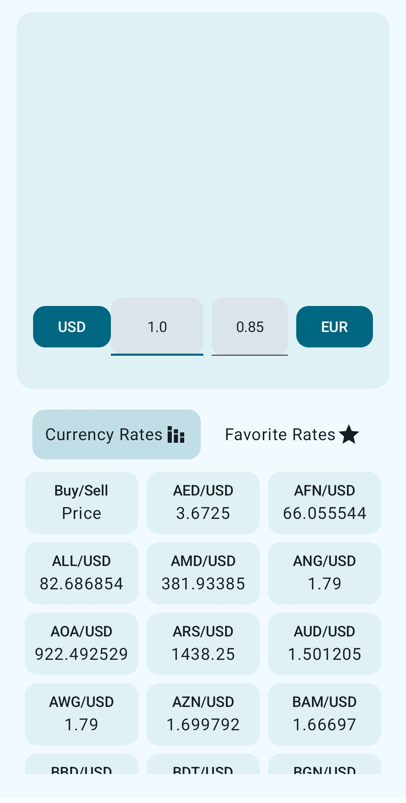
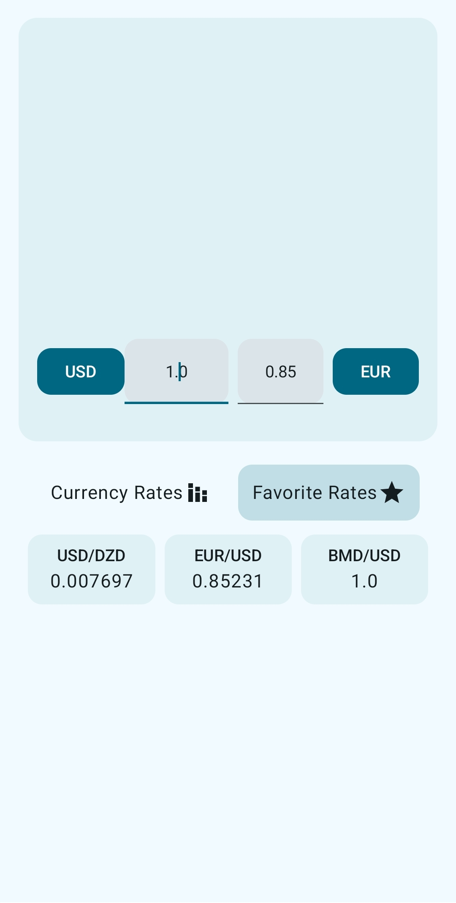
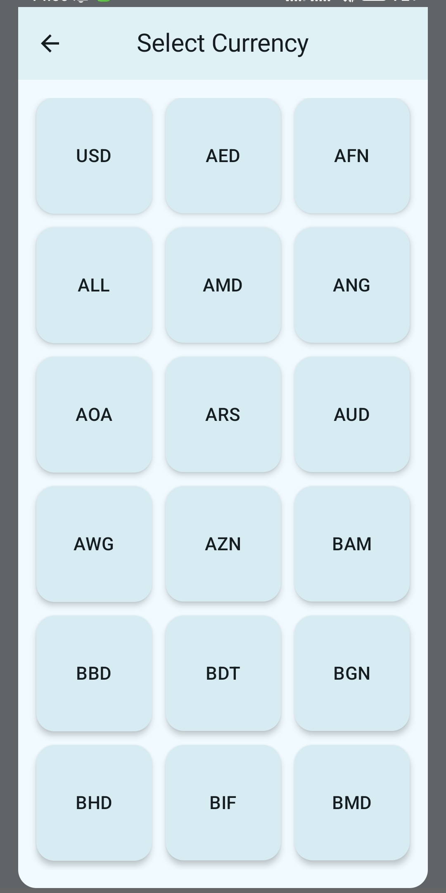

## Currency Exchanger

This application utilizes Retrofit, Hilt, Room, and Jetpack Compose.Users can exchange currencies
from different countries and save the chosen currency pair in their favorites list.
Clean Architecture was
used in the project's design, which is reflected in the code structure.

For currency data, I integrate the Exchange Rate API from https://www.exchangerate-api.com/

## Screenshots

